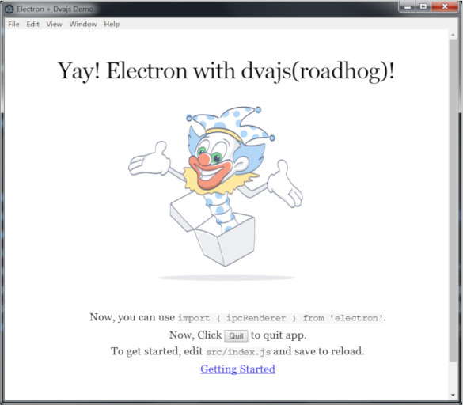

# simple-dva-electron
### 说明

本示例基于Dva.js官方示例修改，在此基础上整合Electron，启动后直接弹出Electron窗体，有修改自动刷新页面




### QuickStart

```
git clone https://github.com/sincerefly/simple-dva-electron.git
cd simple-dva-electron
yarn
yarn start
```


### 备注

没详细了解roadhog的配置模式，为了支持使用`import { ipcRenderer } from 'electron'`的方式导入库，将支持electron的配置写在了`webpack.config.js`

```javascript
const webpack = require("webpack");

module.exports = function (webpackConfig, env) {
    webpackConfig.plugins.push(new webpack.ExternalsPlugin('commonjs', ['electron']))
    return webpackConfig
}
```

如果你了解如何将这段代码放到roadhog的配置文件`.webpackrc`中，欢迎提交pr